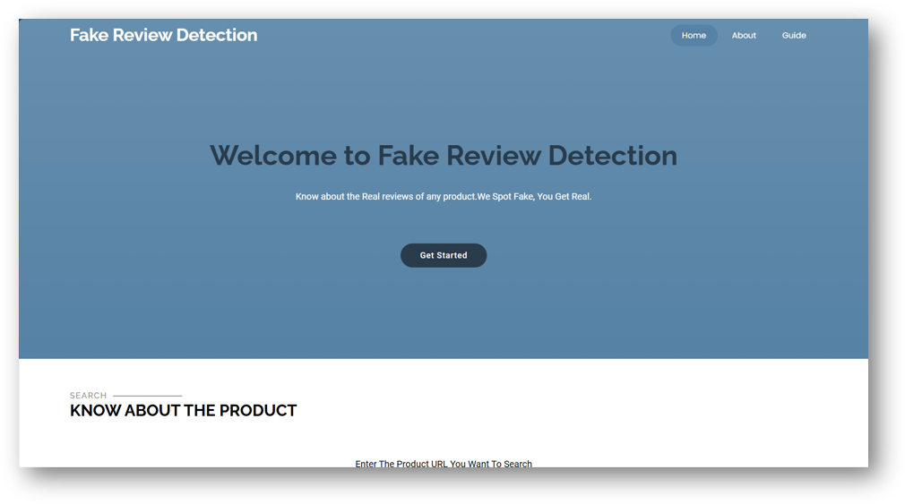

<!-- Improved compatibility of back to top link: See: https://github.com/othneildrew/Best-README-Template/pull/73 -->
<a id="readme-top"></a>

<!-- PROJECT LOGO -->
<br />
<div align="center">
  <h3 align="center">Transformer Based Fake Reviews Detection</h3>
  <p align="center">
    A Project about Predicting the Number of Fake Reviews with Grades of an e-commerce website called Amazon using Machine Learning Models like Bert & XLnet.
    <br />
    <br />
    <br />
  </p>
</div>

<!-- TABLE OF CONTENTS -->
<details>
  <summary>Table of Contents</summary>
  <ol>
    <li>
      <a href="#about-the-project" >About The Project</a>
      <ul>
        <li><a href="#built-with">Built With</a></li>
      </ul>
    </li>
    <li>
      <a href="#getting-started">Getting Started</a>
      <ul>
        <li><a href="#prerequisites">Prerequisites</a></li>
        <li><a href="#installation">Installation</a></li>
      </ul>
    </li>
  </ol>
</details>


<!-- ABOUT THE PROJECT -->

## About The Project




Online marketplaces such as Amazon allow people to share their experiences about purchased  products using textual comments known as product reviews. Online reviews from previous  consumers are key information sources for consumers and marketers. Fake product reviews on e-commerce websites mislead consumers and undermine trust in online marketplaces. Detecting  and eliminating fake reviews is essential to ensure genuine feedback and maintain the platform's  integrity.


<strong>Objectives:</strong>
* Implement an algorithm that classifies reviews as computer generated or original.
* Use transformer models (like BERT ) to detect computer generated reviews.
* Build a web application with a simple, user-friendly interface where users can easily view the results.


<strong>Outcomes:</strong>
* Enhance trustworthiness of reviews on e-commerce platforms by enabling users to distinguish between ai generated and original reviews.<br>
* Encourage customers to make purchases based on more reliable reviews, thereby increasing sales and revenue.<br>
* Deliver a user-friendly web application where users can input product URLs and view analysis results in a clear, understandable format.

 The system is designed as an interactive, user-friendly web
 interface where a user can paste a product URL to get an
 in-depth analysis. This interface provides the summary of a
 product with a total number of computer-generated reviews
 and original reviews. The summary also gives a grade based on
 the percentage of computer-generated reviews, so the user has
 an idea about the overall authenticity of reviews the product
 has, at a glance
<p align="right">(<a href="#readme-top">Back to top</a>)</p>

### Built With

This section includes the languages and frameworks we used to build the project. Here are they:

* [![CSS][CSS-logo]][CSS-url]
* [![HTML][HTML-logo]][HTML-url]
* [![Flask][Flask.com]][Flask-url]
* [![JQuery][JQuery.com]][JQuery-url]
* [![Python][Python.com]][Python-url]
* [![Bootstrap][Bootstrap.com]][Bootstrap-url]
* [![JavaScript][JavaScript-logo]][JavaScript-url]

<p align="right">(<a href="#readme-top">Back to top</a>)</p>


<!-- GETTING STARTED -->
## Getting Started

Before getting started, Check the given 

### Prerequisites
The languages and frameworks must and should isntalled before the executing of the code.
* Python
  ```sh
  On MacOS:
  brew install python
  
  On Linux:
  sudo apt update
  sudo apt install python3
  ```
* Flask
  ```sh
  Using pip:
  pip install flask
  
  Using pip3:
  pip3 install flask
  ```

### Installation

After installing of the prerequistes packages. 
1. <b>Creating a Virtual Environment (Highly Recommended):</b>

    It's strongly recommended to create a virtual environment to isolate project dependencies.
    
    <b>Using venv (for Python 3):</b>
    ```sh
    
    python3 -m venv venv  # Create the virtual environment
    source venv/bin/activate  # Activate the environment (Linux/macOS)
    venv\Scripts\activate  # Activate the environment (Windows)
    ```
2. <b> Installing Dependencies:</b>

    The requirements.txt file should contain all the necessary packages. Navigate to the project directory (if you haven't already) and install the required Python packages using ```pip```:
   ```sh
   cd YOUR_REPOSITORY # If you are not already in the project directory
   pip install -r requirements.txt
   ```
3. <b> Running the Application:</b> 

    To start the Flask web server, navigate to the directory containing your main   application file (e.g., app.py) and run:
   ```sh
    python app.py
   ```

<p align="right">(<a href="#readme-top">back to top</a>)</p>


[Bootstrap.com]: https://img.shields.io/badge/Bootstrap-563D7C?style=for-the-badge&logo=bootstrap&logoColor=white
[Bootstrap-url]: https://getbootstrap.com
[JQuery.com]: https://img.shields.io/badge/jQuery-0769AD?style=for-the-badge&logo=jquery&logoColor=white
[JQuery-url]: https://jquery.com 
 [Python.com]:https://img.shields.io/badge/Python-3776AB?style=for-the-badge&logo=python&logoColor=fff
 [Python-url]: https://www.python.org/
 [Flask.com]: https://img.shields.io/badge/Flask-000?style=for-the-badge&logo=flask&logoColor=fff
 [Flask-url]: https://flask.palletsprojects.com
 


[HTML-logo]: https://img.shields.io/badge/HTML-%23E34F26.svg?style=for-the-badge&logo=html5&logoColor=white
[HTML-url]: https://developer.mozilla.org/en-US/docs/Web/HTML
[CSS-logo]: https://img.shields.io/badge/CSS-1572B6?style=for-the-badge&logo=css3&logoColor=fff
[CSS-url]: https://developer.mozilla.org/en-US/docs/Web/CSS

[JavaScript-logo]: https://img.shields.io/badge/JavaScript-F7DF1E?style=for-the-badge&logo=javascript&logoColor=000
[JavaScript-url]: https://developer.mozilla.org/en-US/docs/Web/JavaScript
[product-screenshot]: https://github.com/ImmanuelSandeep/Transofrmer-Based-Fake-Review-Detection/blob/0ea042f80f3d040036bf64818d3eda7e92df4d51/Screenshots/Picture1.png
